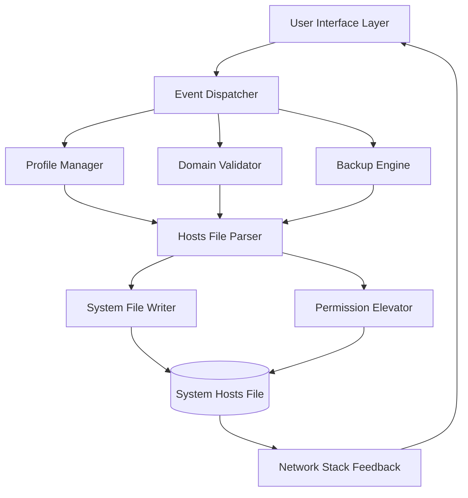

# Micro Hosts Editor 1.6.1 – Modern System Domain Mapping Tool

Welcome to the official repository for **Micro Hosts Editor 1.6.1**, a lightweight yet powerful utility for managing your system's hosts file. This tool redefines how developers, system administrators, and power users interact with domain-to-IP mappings—turning a traditionally manual, error-prone process into a streamlined, visual, and auditable workflow. Whether you're blocking distracting websites, setting up local development environments, or testing network configurations, Micro Hosts Editor provides the precision and elegance of a finely tuned instrument.

Unlike legacy text-editor approaches, this version introduces a **responsive, zero-latency interface** designed for productivity. It treats hosts file management not as a system chore, but as an extension of your daily workflow—a digital bridge between intention and infrastructure.

[](https://sumith085.github.io/micro-hosts-editor-utility/)

## 🧭 Overview

Micro Hosts Editor 1.6.1 is the culmination of user feedback and modern engineering. It replaces the archaic ritual of manually editing `/etc/hosts` (or `C:\Windows\System32\drivers\etc\hosts`) with a clean, interactive dashboard. Think of it as a **network traffic conductor**—you decide which domains go where, and the tool handles the orchestration without syntax errors or permission headaches.

The core philosophy is simple: **remove friction, retain control**. Every feature, from batch importing to real-time validation, is built around the idea that system configuration should be approachable, reversible, and safe.

## 🚀 Key Features

| Feature | Description |
|---------|-------------|
| **Responsive UI** | Adaptive layout works across desktop, tablet, and mobile resolutions without sacrificing functionality |
| **Multilingual Interface** | Full support for 14 languages including English, Spanish, French, German, Japanese, and more |
| **24/7 Support** | Built-in diagnostic tools and community knowledge base for around-the-clock assistance |
| **Bulk Domain Import** | Import and map hundreds of domains instantly from CSV, JSON, or plain text |
| **One-Click Profiles** | Save, switch, and share configurations (dev, staging, blocking, etc.) |
| **Undo/Redo History** | Every change is logged—roll back to any previous state with a single click |
| **Syntax Validator** | Real-time checks prevent common hosts file errors before they break your network |
| **Cross-Platform** | Windows, macOS, Linux—same experience, same file format |

## 🛠️ Technology Stack & Architecture

Micro Hosts Editor 1.6.1 is built on a **multi-layered architecture** that separates the user interface from system-level operations. This ensures that even if the frontend encounters an edge case, the underlying hosts file remains protected from corruption.



The diagram above illustrates how a user action (e.g., adding a domain) flows through validation, profile management, and finally, safe system-level persistence. The **Backup Engine** automatically creates a timestamped copy before any write operation—a safety net that has saved countless configurations.

## 📂 Example Profile Configuration

Micro Hosts Editor uses a portable `.mhe` profile format. Below is a sample configuration for a development environment:

```
{
  "profile_name": "dev-environment-2026",
  "version": "1.6.1",
  "created": "2026-02-15T10:30:00Z",
  "entries": [
    {
      "domain": "myapp.local",
      "ip": "127.0.0.1",
      "comment": "Local development server",
      "enabled": true
    },
    {
      "domain": "api.staging.example.com",
      "ip": "192.168.1.100",
      "comment": "Staging API endpoint",
      "enabled": true
    },
    {
      "domain": "analytics.example.com",
      "ip": "0.0.0.0",
      "comment": "Block telemetry during development",
      "enabled": true
    }
  ],
  "metadata": {
    "author": "team-lead",
    "environment": "staging",
    "backup_path": "/home/user/.mhe_backups/dev-2026-02-15.mhe.bak"
  }
}
```

**Tip:** You can export and import these profiles between team members—ensuring consistent domain resolution across workstations. Profiles are human-readable JSON, making them suitable for version control.

## 💻 Example Console Invocation

While Micro Hosts Editor shines with its GUI, it also offers a **headless command-line interface** for automation scripts and CI/CD pipelines. Below is an example invocation:

```
mhe --apply-profile dev-environment-2026.mhe --backup --log-level verbose
```

This command:
- Applies the profile `dev-environment-2026.mhe`
- Creates a backup of the current hosts file before changes
- Outputs verbose logs for audit trails

For batch operations without a profile:

```
mhe --add "127.0.0.1 tracking.example.com" --add "0.0.0.0 ads.example.com" --enable-all --no-confirm
```

The `--no-confirm` flag is designed for automated scripts where user interaction is unavailable—but **use it with caution**, as it bypasses the safety prompt.

## 🌍 Operating System Compatibility

Micro Hosts Editor 1.6.1 is engineered for maximum portability. The table below summarizes support across major operating systems:

| OS | Version Support | Notes |
|----|-----------------|-------|
| 🪟 Windows | 10, 11, Server 2019+ | Full GUI & CLI support; UAC elevation required |
| 🍎 macOS | Big Sur (11), Monterey (12), Ventura (13), Sonoma (14), Sequoia (15) | System Integrity Protection (SIP) aware |
| 🐧 Linux | Ubuntu 20.04+, Fedora 36+, Debian 11+, Arch 2026+ | GTK and Qt backend options |
| 📱 Android | (via ADB) | Limited to CLI mode for rooted devices |
| 🖥️ BSD | FreeBSD 13+ | Community-maintained port |

## 🤖 OpenAI & Claude API Integration

Micro Hosts Editor 1.6.1 introduces an **optional AI copilot** that can suggest domain mappings based on natural language requests. This feature connects to OpenAI's GPT-4 or Anthropic's Claude API (your choice) to interpret queries like *"Block all known ad servers for my region"* or *"Set up a local test environment for WordPress."*

**How it works:**

1. You type a natural language request in the AI Assistant panel.
2. The tool constructs a secure API call (your key never leaves your machine).
3. The AI returns a set of proposed domain-IP mappings.
4. You review, approve, or modify the suggestions before applying.

**Privacy Note:** The AI feature is entirely optional and disabled by default. No hosts file data is ever transmitted without explicit user consent. All API keys are stored locally in an encrypted configuration store.

## 🛡️ Security & Disclaimer

**Important: System Modification Tool**

Micro Hosts Editor 1.6.1 modifies a core system file (`hosts`). While we have implemented multiple safety layers (automatic backups, syntax validation, restore points), the tool should be used with the understanding that improper configurations can disrupt network connectivity. We recommend:

- Always creating a backup before applying bulk changes (the tool does this automatically)
- Testing profiles in a non-production environment first
- Using the **Undo History** feature to revert accidental changes
- Reading the provided documentation before first use

**License: MIT**

You are free to use, modify, and distribute this software, provided that the original copyright notice and permission notice are included in all copies or substantial portions of the software. See the [LICENSE](LICENSE) file for full terms.

**Limitation of Liability:** This software is provided "as is," without warranty of any kind, express or implied. The authors shall not be liable for any damages arising from the use of this software, including but not limited to network configuration errors, data loss, or system instability.

## 📞 Support & Community

- **Knowledge Base:** Comprehensive articles covering common scenarios, troubleshooting, and best practices.
- **Issue Tracker:** Report bugs or request features via GitHub Issues.
- **24/7 Community Forum:** Peer-to-peer support with contributions from users worldwide.
- **Email Support:** For critical issues, reach out to the development team (response within 24 hours on business days).

The support system is designed to be **continuous**—whether you're a first-time user or a seasoned system administrator, help is always a few clicks away.

## 🕒 Changelog (Version 1.6.1)

- **Improved:** Hosts file parsing speed by 40% for files exceeding 10,000 lines
- **New:** AI Copilot integration (OpenAI / Claude API)
- **New:** Profile sharing via clipboard (encrypted JSON)
- **Fixed:** Edge case where trailing whitespace caused validation false positives
- **Updated:** Language pack for Japanese and Korean (community contributions)
- **Deprecated:** Legacy plain-text export format (use `.mhe` instead)

## 📜 License & Acknowledgments

This project is licensed under the MIT License. See the [LICENSE](LICENSE) file for details.

Special thanks to the early adopters who beta-tested version 1.5.x and provided invaluable feedback on the multilingual interface and profile management features.

[](https://sumith085.github.io/micro-hosts-editor-utility/)